# 팀 프로젝트
- URL : https://it-magician.github.io/SSAFY_CRAFTS/2%EB%B2%88%EC%A7%B8%20%EA%B4%80%ED%86%B5  
- 알림 : XML이 요구되는 페이지가 동작안하는건 다음과 같은 이유임.  
         1. 하루 허용 사용량 초과 2. 공공데이터 service key만료  
         xml을 받는 내용은 apt.js파일의 url부분에 있음. 2개의 url이 있을텐데, 첫번째는 select box용임. 두번째일거야.
         
         .... 걍 직접 호스팅해야할듯.. 내가 공공데이터포털에서 신청한 xml은 https프로토콜을 지원을 안함(만약 이걸 할거면, 다른서버에서 받아와서 전달하는 redirect를 써야할듯...) vs code에서 live server로 실행해서 확인해야할듯..  
         
         
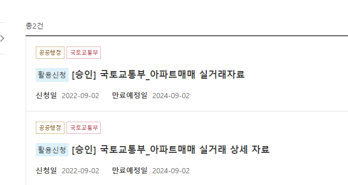  

 # 제작자
 나, 안소희님

## 역할
 ### 나
 - 프론트 작성(CSS, JAVASCRIPT), KAKAO MAP API 호출 및 사용자 입력에 따른 ACTION
 - CSS : LAYOUT, COLOR 배치(ADOBE COLOR사용함), TRANSITION이랑 KEYFRAME 이용해서 애니메이션 작성(예 : NAVBAR 애니메이션, LOGIN페이지 배경 등), ACCORDIAN(NAVBAR ITEM의 MAP, JS없이 CSS로만 구현함)
 - (하도 많아서.. 이젠 기억이 안나.. 걍.. 소희님이 안한건 내가 다한거임)

 ### 소희님
 - 로그인 동작(JS) 작성
 - 공공데이터 포털에서 XML 받아오는거
 
#### 협업작업
- 데이터를 웹페이지에 표시하는 것. 소희님이 설계한 JSON데이터를 내가 조사한 JAVASCRIPT QUERYSELECTOR의 innerHTML/outerHTML 및 createContextualFragment을 이용해 표시함
- 요구사항에서 빠진 것이 뭐가 있는지 같이 이야기함

# 결과물
### a.	메인 페이지(동 별, 아파트 별 실거래가 조회 기능 포함)
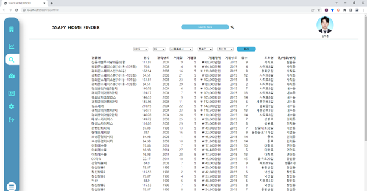

### b.	요구사항의 Main 페이지(아파트 상세 검색)
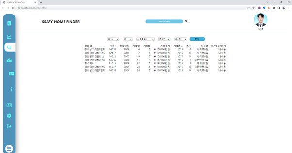

### c.	아파트별 실거래가 조회 결과 페이지
##### - 조회 결과물
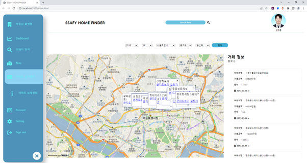

##### - 노란색 상자를 클릭했을 때 : 그 아파트 위치의 마커로 지도의 중심을 이동시키면서 지도의 크기를 level6만큼 확대함
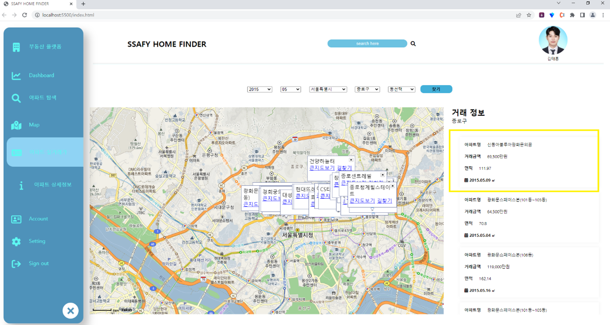
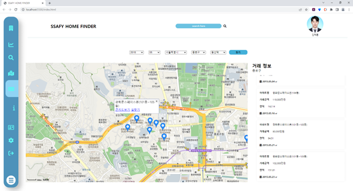

### d.	회원정보 등록, 수정, 삭제, 조회 페이지 & 로그인/ 로그아웃 페이지
#### - 로그인 페이지
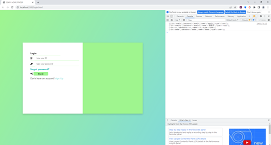

#### - 회원 가입 페이지
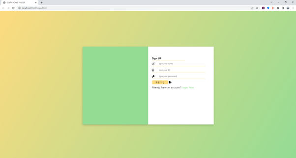

#### - 회원 정보 조회 & 회원 정보 수정 & 회원 정보 삭제(탈퇴)
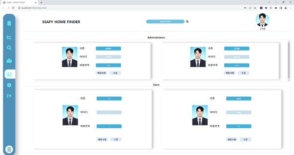  
*설명 : 사용자 계정으로 접속 했을 때, 자기자신의 정보만 접근할 수 있음*

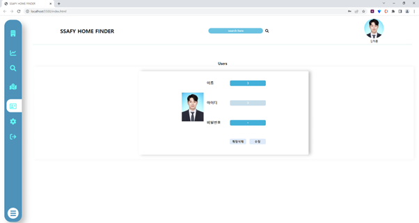  
*설명 : root계정으로 접속했을 때, 모든 사용자의 정보를 접근할 수 있음*

### - 로그아웃
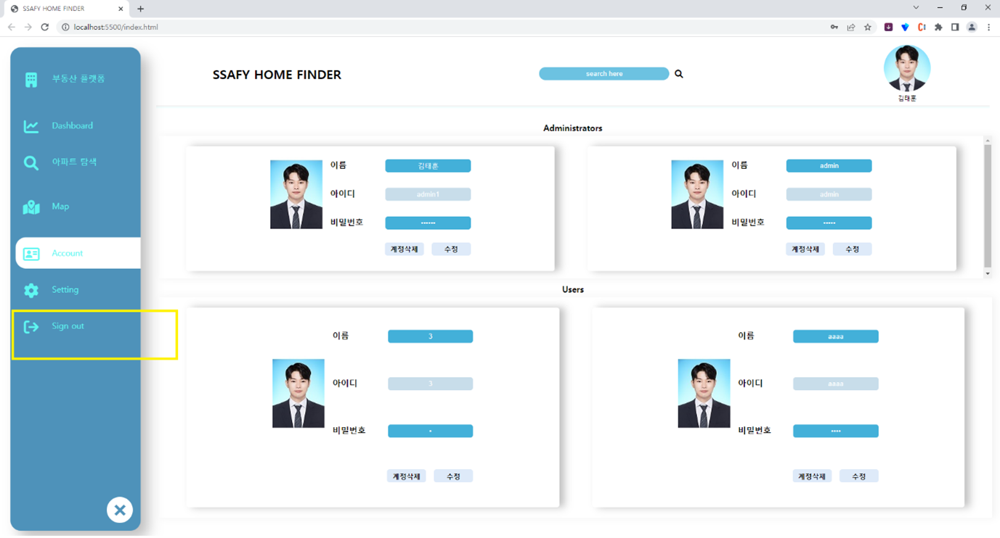

## 기타사항
### - XML데이터를 받아올 때, 로딩페이지를 띄움. 많은 양의 XML을 받아올 경우, 렉이 걸리거나 아무런 동작이 안하는 것 처럼 느껴짐. 개발자가 아닌 사용자는 이점을 모르기 때문에, 로딩페이지를 만듬
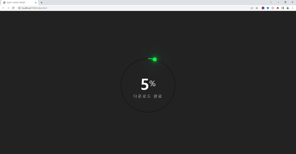

### - 페이지를 교체하는 건, 이동을 하지 않고 화면에서 별도의 교체영역에서 내용만 교체하도록 만듬, 그 영역을 html에서 contents class로 지정함.
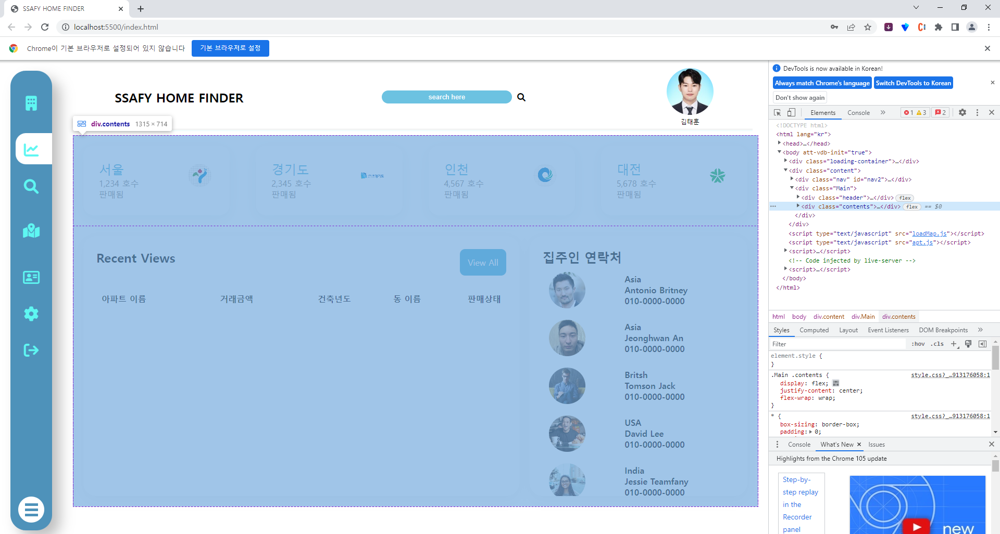

### - Navbar의 맨 하단 오른쪽의 hambergur버튼 클릭시, Navbar의 width가 커짐. 반응형 웹에 맞게 제작했기 때문에, Navbar가 아닌 영역에서도 자동으로 레이아웃이 맞춰지도록 설계하였음.

### - Navbar Item의 Dashboard에서 Recent View가 의미하는 것
- Map탭. 사용자가 관심이 있어서, 오른쪽 상자들을 클릭하면 History로 남게됨. 이걸 Recent Views에 표시하도록 만듬. 판매상태는 Random함수를 사용, JAVASCRIPT로 HTML Class에 "Status"에서 "Status Selling", "Status Sold" 등을 추가하면, CSS에서 '판매중' 등을 표시하도록 만듬. <-- css의 override 및 우선순위(detail할 수록 우선순위가 커지는 거)를 이용함  
(???라고?, readme에 있는 그림의 노란색 상자를 말하는 거임. 그걸 클릭하면 history로 남겨서, recent view로 만듬)

### - CSS 관련
- 사용자에게 표시하는 부분은 최대한 CSS로 구현하였음. 예를 들어 Navbar의 width를 늘린다던지, 웹페이지의 내용을 업데이트 할 때 반복되는 글자이면 Sold, Active, Clicked 등의 클래스를 JS로 추가하기만 하면, CSS에서 작업하도록 만듬. 즉, JS는 CSS에게 이벤트가 발생했다는 것을 알려주기만 하고, 텍스트, div의 width 변경 등은 CSS에서 담당함. 

