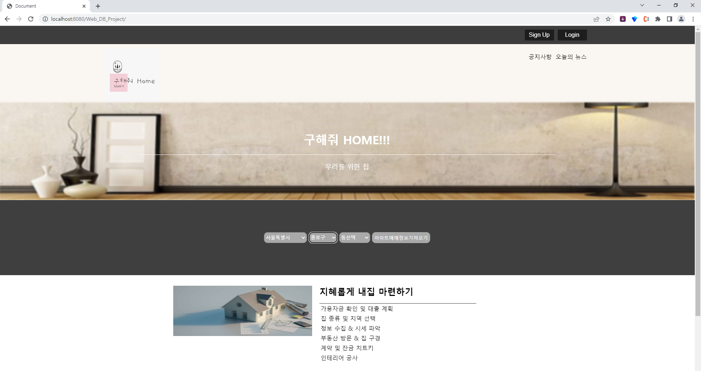
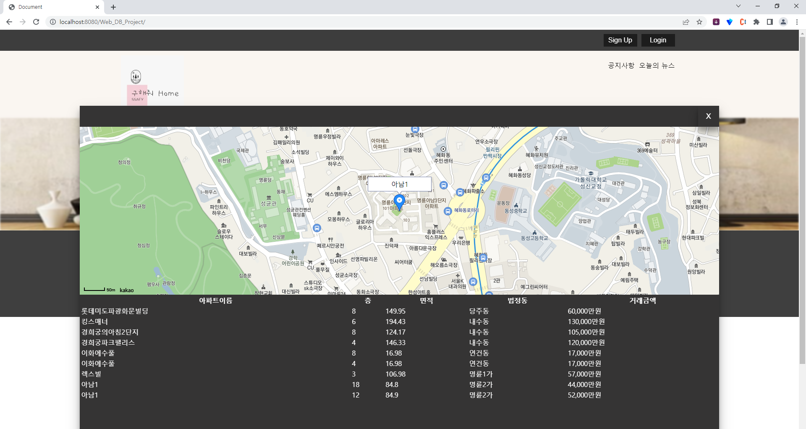
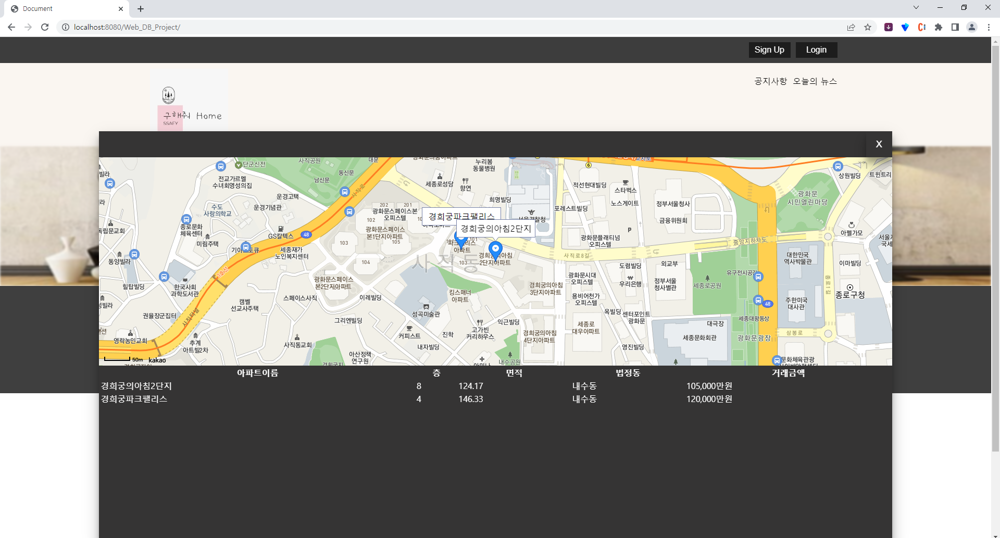
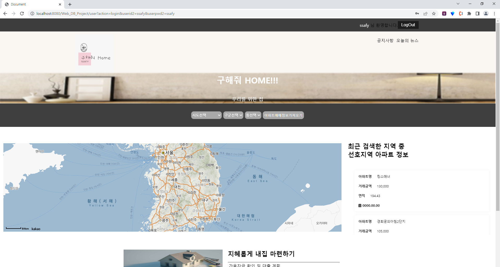
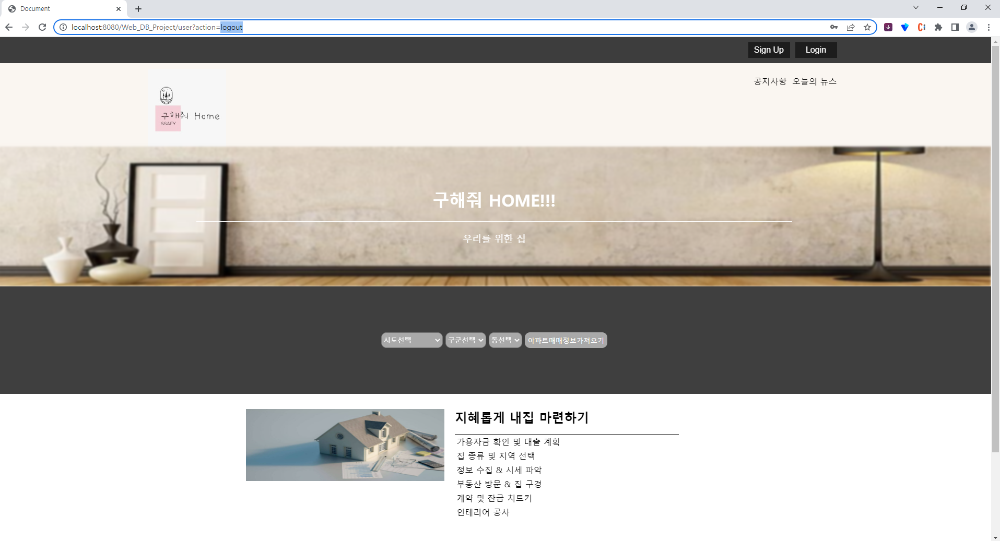

# 백엔드 제작
* 아파트 조회시 데이터를 가져오도록 만듬  
  (클라이언트 데이터 요청 --> 서버 요청 받음 --> Controller('com.ssafy.apartment.controller')가 서비스 호출 --> DB Access후 데이터를 DTO묶음으로 된 ArrayList에 담음(만약 DB 데이터가 empty상태라면, 공공데이터의 REST API를 이용하여 파싱후 DB에 넣음. 그 다음에 데이터를 전달하도록 만듬) --> json string으로 클라이언트에 보냄(java의 toString을 override를 해서 json으로 만듬) --> 클라이언트 데이터 받음 --> html table 내용 및 KAKAO 지도 업데이트  
  ** 아파트 조회시, '구/군'까지만 설정후 데이터 요청했을 때
  
  
  ** 아파트 조회시, '동'까지 설정후 데이터 요청했을 때  
  
  
  
* 로그인을 하면, 가입자들이 검색한 아파트 지역들을 보여주도록 만듬  
  
  
* 사용자 선호지역  
(클릭 이벤트가 발생할 때마다 DB에 저장된 사용자 선호지역을 동기화하도록 설정함)  
[사진]  


### 시작전에 해주어야하는 설정  
mysql : db schema 및 table 생성 필요
```sql
create database webdaejeon8th;
use webdaejeon8th;
CREATE TABLE `transaction` (`apt` VARCHAR(100),`floor` VARCHAR(10),`area` VARCHAR(100),`jibun` VARCHAR(100),`dong` VARCHAR(100),`transactionAmount` VARCHAR(100),`sigunguCode` VARCHAR(100));
create table userFavor(    id varchar(100),    code varchar(100),    dong varchar(100),    primary key(id,code,dong));
create table member(
    id varchar(100) primary key,
    pw varchar(100),
    name varchar(100),
    adr varchar(100)
);
```
