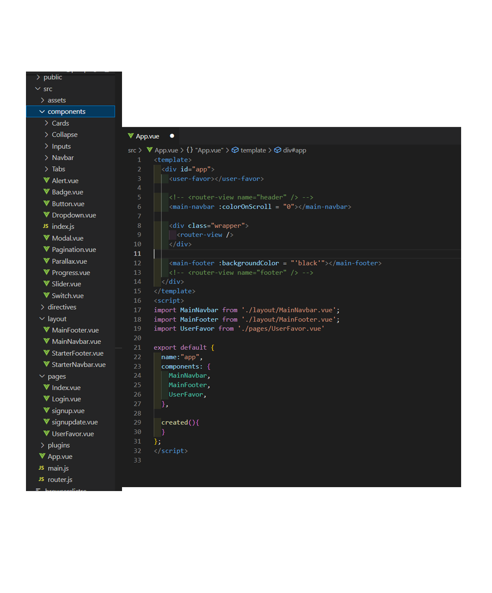
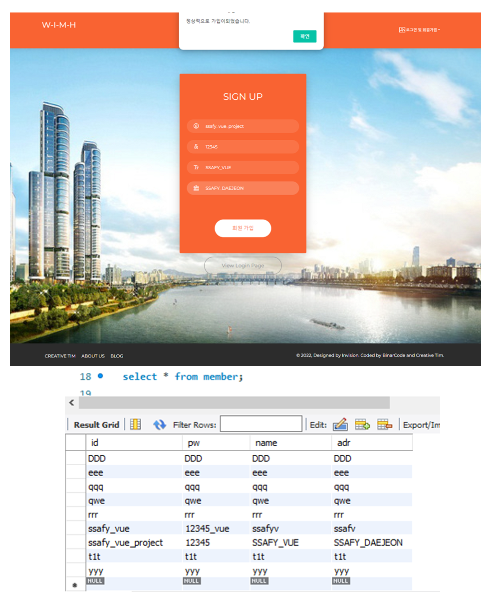
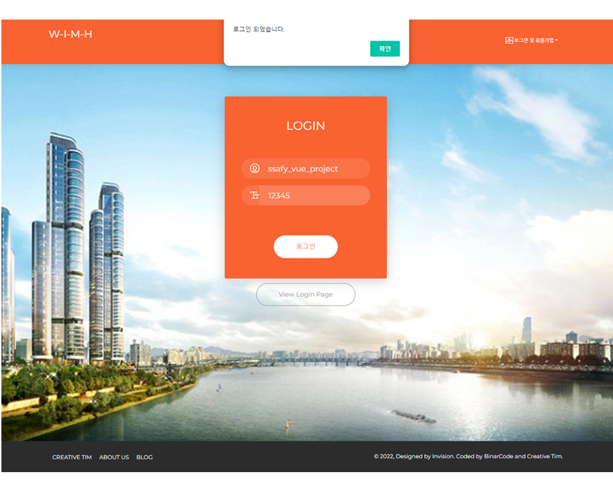
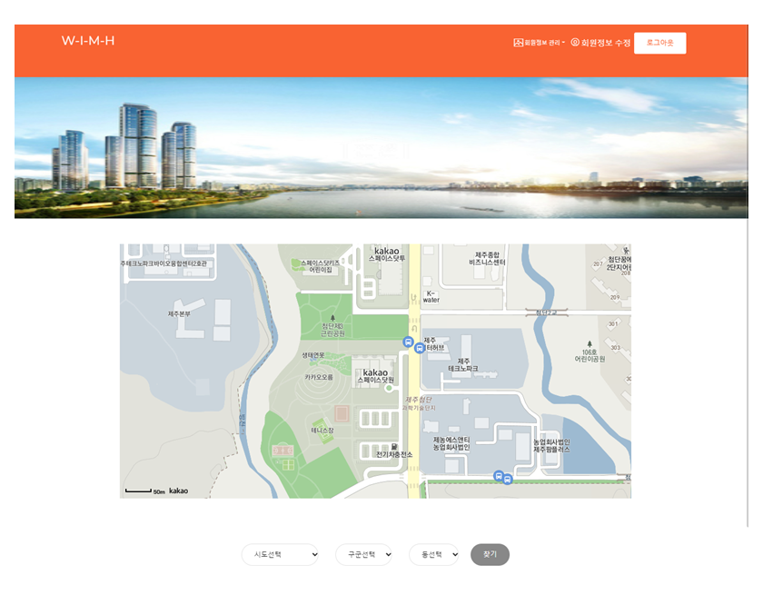
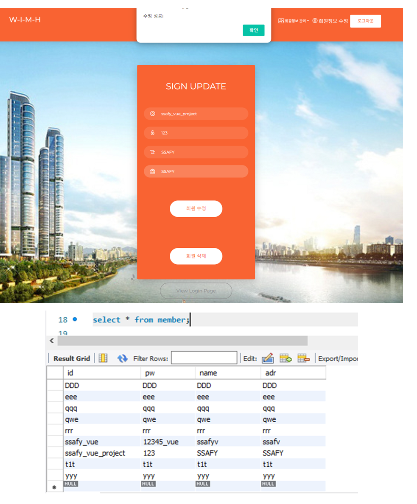
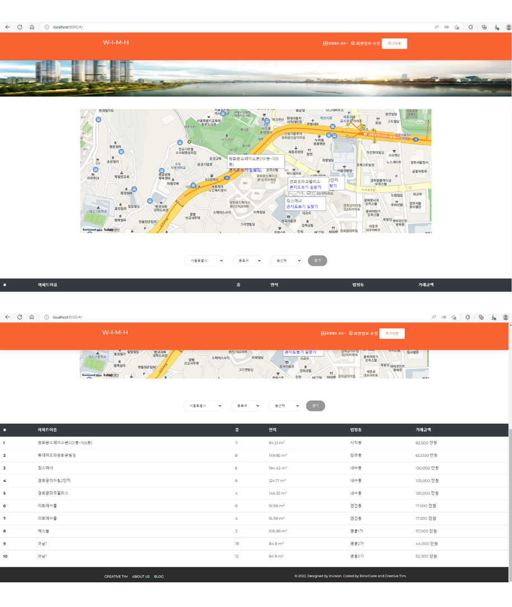
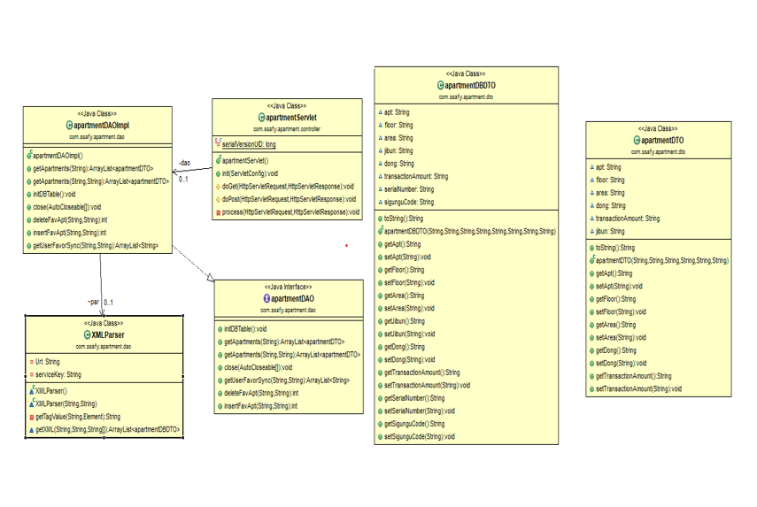

# 5번째 관통 프로젝트

## 아파트 상세 정보를 알려주는 서비스.

Rest Api와 Vue.js를 기반으로 SPA를 만드는 프로젝트(npm 기반, scss 등 의존성 패키지 설치 필요)

- Spring
- MySQL
- MyBatis
- Vue.js

- 팀원이 가져온 프론트 템플릿을 프로젝트에 맞게 수정.  
  (제가 할줄 알아서 했습니다. Table 등 없는 CSS 추가를 했고, 어려워하는 팀원을 위해 분석후 필요한 파일들만  )
- 역할 : 아파트 상세정보(아파트 실거래가, 지도 API 등), 로그인 백엔드 부분

# preview

- 컴포넌트 구조화  
  
- 회원 가입 (Rest API 및 Vue 사용)  
  
- 로그인
  
- 로그인 시 화면
  
- 회원 정보 수정, 삭제
  
- 아파트 매매 정보 조회
  
- 클래스 다이어그램
  
